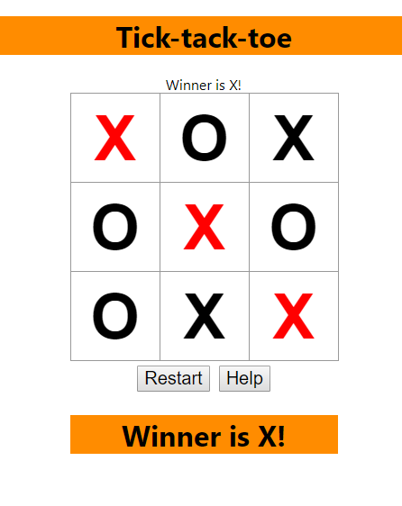

##This project is a tic-tac-toe implementation using React.
This project is a task on the courses of the company DSR - JS BootCamp 2019.
## After cloning the repository, you need to run this command in the project directory:

### `npm insall`

In the project directory, you can run:

### `npm start`

Runs the app in the development mode. 
Open [http://localhost:3000](http://localhost:3000) to view it in the browser.

The page will reload if you make edits. 
You will also see any lint errors in the console.

## Implemented functionality:
1. Game process.
2. Button "restart" to restart the game at any time.
3. Display information about the current player.
4. Help button. When you click on it, the computer will play for the current player.
5. Сonclusion inflomations about the winner and highlighting the winning combination.

## Interface:

